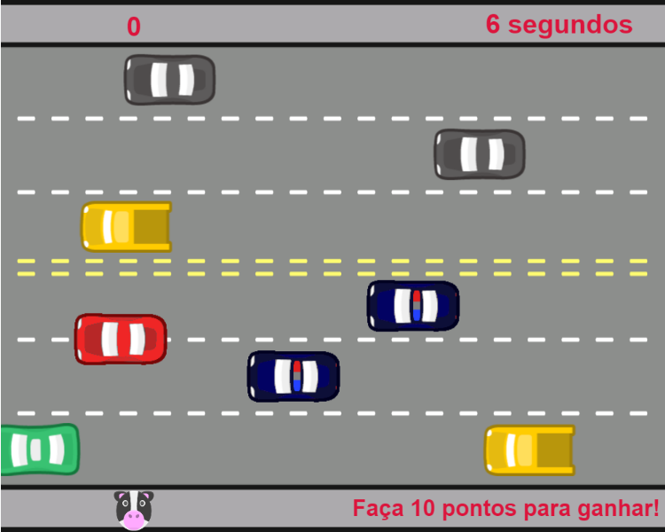

# Jogo Freeway em JS - Curso Alura

Recriação e adaptação do jogo Freeway em JavaScript no curso Lógica de programação: laços e listas com JavaScript da Alura. 

  

No dia 20 de fevereiro de 2023 conclui o curso *Lógica de programação: laços e listas com JavaScript*, onde desenvolvemos uma versão do jogo Freeway. O [Freeway](https://pt.wikipedia.org/wiki/Freeway_(jogo_eletr%C3%B4nico)) foi um jogo lançado para Atari 2600 em 1981, onde o jogador controlava uma galinha e precisava atravessar uma rodovia.

Link do curso [aqui](https://cursos.alura.com.br/course/javascript-listas-lacos).

## Tecnologias

* JavaScript
* [P5 JS Editor](https://p5js.org/)

## Bibliotecas utilizadas

* [p5.collide2D](https://github.com/bmoren/p5.collide2D)

## Jogo

* Para ver o resultado final do projeto do curso e jogar clique [aqui](https://editor.p5js.org/lucsanro/full/XAMG-ZbvU).

## Certificado

* Meu certificado [aqui](https://cursos.alura.com.br/certificate/dbdcf660-94fc-44d8-b910-c77c83983a86).

